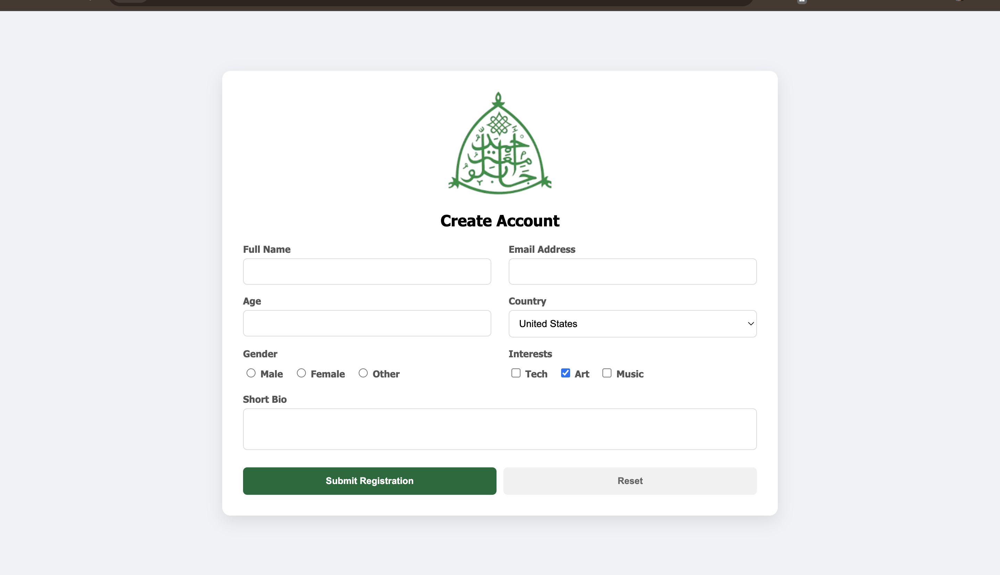

# User Registration System

This project focuses on building a responsive, grid‑based user registration system. The interface is designed as a clean, single‑page layout that prominently features the ABU logo for branding. The front end is structured with HTML5 for semantic clarity and CSS3 Grid for a flexible, responsive layout, while the back end leverages PHP with PDO to ensure secure database interaction.

## Features
- **Secure Backend**: Implements PHP Data Objects (PDO) with prepared statements to prevent SQL Injection.
- **Responsive Design**: Implemented a single screen design that adapts to any screen sizes.
- **Data Validation**: Includes both HTML5 client-side validation and PHP server-side sanitization.

## Registration Form Preview



## Technology Stack

- **Front-end**: HTML5, CSS3
- **Back-end**: PHP 8.x
- **Database**: MySQL
- **Driver**: PDO

## Setup & Installation

1. **Clone the repository**:
   ```bash
   git clone https://github.com/fridayonojah/WEB-ENGINEERING-ASSIGNMENT-COSC407.git
   ```

2. **Database Configuration**:
   - Open your MySQL administration tool phpMyAdmin.
   - Create a new database named `registration_db`.
   - Import the following SQL schema:
   ```sql
   CREATE TABLE users (
       id INT AUTO_INCREMENT PRIMARY KEY,
       fullname VARCHAR(100) NOT NULL,
       email VARCHAR(100) NOT NULL,
       age INT,
       gender VARCHAR(20),
       country VARCHAR(50),
       interests TEXT,
       bio TEXT,
       created_at TIMESTAMP DEFAULT CURRENT_TIMESTAMP
   );
   ```

3. **Deploy to Server**:
   - Move the project files into your local server directory (e.g., `C:/xampp/htdocs/` or `/var/www/html/`).
   - Ensure your MySQL credentials in `submit-registration.php` match your local environment settings:
   ```php
   $user = 'root'; 
   $pass = '';
   ```

4. **Run the Project**:
   - Open your browser and navigate to `http://localhost/registration-system/index.html`.


## Input Validation Feature

- **XSS Protection**: All user inputs are sanitized using `htmlspecialchars()`.
- **SQL Injection Prevention**: Uses PDO Prepared Statements to ensure data and queries are handled separately.
- **Input Filtering**: Uses `filter_var()` for email and integer validation to ensure data integrity.

---
*Created for [COSC407 WEB APPICATION ENGINEERING II/Create User Registration]*